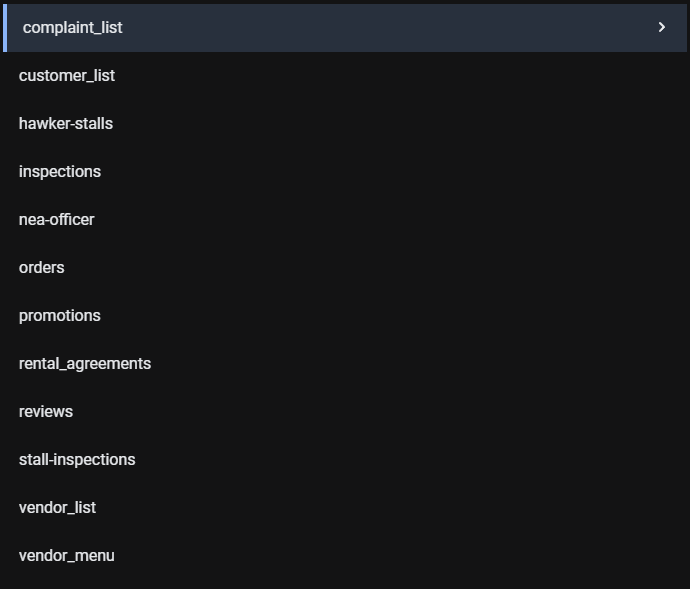
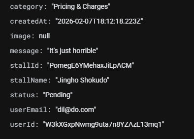

# MyHawker - Front-End Development Assignment

Sean Ulric Buguina Chua, Cedrik Hwang, Isaac Luke Ng, Samuel Fhu, Jaron Lee.

The site is deployed at this link [https://seansc12.github.io/fed_assignment/src/pages/index.html](https://seansc12.github.io/fed_assignment/src/pages/index.html)

## Project Overview

MyHawker is a multi-user platform that delivers value for three stakeholders:
- **Customers** to browse hawker stalls, view menus, place orders, track their orders, write reviews, and file complaints
- **Vendors** to manage their stalls, menus, orders, and promotions
- **NEA Officers** to monitor hygiene grades, review complaints, and track stall compliance

## Prerequisites

Before running this application, ensure you have the following installed:

- **Web Browser**: Modern browser (Chrome, Firefox, Edge, Safari - latest version recommended)
- **Git**: [Download Git](https://git-scm.com/downloads)
- **Node.js** (Optional, for development tools): [Download Node.js](https://nodejs.org/) - LTS version recommended
- **Live Server** or similar local development server

## Installation & Setup

### 1. Clone the Repository

```bash
git clone https://github.com/SeansC12/fed_assignment.git
cd fed_assignment
```

### 2. Install Dependencies

```bash
npm install
```
This installs important dependencies required for the app to run, namely `tailwindcss` and `firebase`. `prettier` is also installed but not necessary for your grading.

### 3. TailwindCSS

Build your TailwindCSS classes via the command below:
```bash
npm run build:css
```

### 4. Firebase Configuration

**IMPORTANT**: The Firebase configuration is already included in the codebase with API keys. For grading purposes, no additional Firebase setup is required. The application connects to a pre-configured Firebase project. We've given you access to our Firebase project via your NP email.


We wrote about our Firebase configuration below.

## Running the Application using Live Server

1. Open the project folder in Visual Studio Code
2. Install the "Live Server" extension if not already installed
3. Right-click on `src/pages/index.html`. This is the entrypoint.
4. Select "Open with Live Server"

# App roles (and developer for each feature)

### Customer Portal (Done by Sean Ulric Buguina Chua)
**Entry Point**: [src/pages/customer/customer-login/customer-login.html](src/pages/customer/customer-login/customer-login.html)

**Test Account**:
- Email: `sean@gmail.com`
- Password: `password`

Our customer registration feature is functional. We encourage you to create your own account instead of use the above.

**Features**:
- Browse hawker stalls by cuisine
- Filter by offers and ratings
- Search and view stall menus
- View promotions for individual menu items and order discounted items
- Add items to cart and place orders
- Write and view reviews
- Give likes (or Hearts) to individual menu items
- File complaints (Done by Isaac Luke Ng)
- Track order history

### Vendor Portal (Done by Cedrik Hwang Hong Yi)
**Entry Point**: [src/pages/vendor/vendor_login/vendor-login.html](src/pages/vendor/vendor_login/vendor-login.html)

**Test Account** (or create your own):
- Email: `vendor@test.com`
- Password: `password123`

**Features**:
- Register and manage stall details
- Create and organize menu items
- Manage promotions and discounts
- View and process customer orders
- Respond to complaints
- Update account information

### NEA Officer Portal (Done by Jaron Lee and Samuel Fhu)
**Entry Point**: [src/pages/nea_officer/home/log_in/login.html](src/pages/nea_officer/home/log_in/login.html)

**Features**:
- View hawker centre locations on interactive map (Samuel)
- Dashboard for individual hawker stall (Samuel)
- Submit hygiene grades for stalls
- Review customer complaints
- Monitor flagged stalls
- Generate hygiene reports

## User Authentication (Done by Isaac Ng)
**Entry Point**: `/src/pages/index.html`

**Features**:
- Customer login and registration
- Customer "Change your password"
- Vendor login and registration
- Vendor stall creation (upon vendor registration)
- Vendor "Change your password"
- NEA Officer login (no registration for the NEA Officer, it was a team decision)

## Key Features

### For Customers
- **Smart Filtering**: Filter stalls by cuisine, active promotions, and ratings (4.0+, 4.5+)
- **Real-time Search**: Search menu items by name, description, or category
- **Save some money!**: View by promotions and purchase items at a discount
- **Shopping Cart**: Persistent cart with quantity controls and discount calculations
- **Reviews & Ratings**: Write detailed reviews and view aggregated ratings
- **Order Tracking**: View complete order history with status updates

### For Vendors
- **Stall Management**: Upload stall images (converted to base64), set cuisine types
- **Menu Organization**: Create categories, add items with images, manage stock
- **Promotion System**: Create time-based promotions with discount percentages
- **Order Management**: View and process incoming orders
- **Complaint Resolution**: View and respond to customer complaints

### For NEA Officers
- **Interactive Map**: Visualize all hawker centres across Singapore
- **Hygiene Grading**: Submit and track hygiene scores
- **Complaint Monitoring**: Review customer complaints and stall responses
- **Compliance Tracking**: Monitor stalls with poor hygiene or frequent complaints

## Project Structure

Our codebase is separated by stakeholder under the `src/pages` directory.

Inside each folder is a page. For example, `src/pages/customer/home` is one page, inside which has `home.html` and `home.js`. This folder thus represents all the files needed for that page. `src/pages/customer/stall` is yet another page.

This groups up all markup and JS for each page in the same directory.

```
fed_assignment/
├── src/
│   ├── pages/
│   │   ├── customer/            # Customer-facing pages
│   │   │   ├── home/            # Browse stalls with filters
│   │   │   ├── stall/           # Stall details and menu
│   │   │   ├── cart/            # Shopping cart
│   │   │   ├── my-orders/       # Order history
│   │   │   ├── customer-login/  # Authentication
│   │   │   └── file_complaint/  # Submit complaints
│   │   ├── vendor/              # Vendor portal
│   │   │   ├── dashboard/       # Vendor overview
│   │   │   ├── create_stall/    # Stall registration
│   │   │   ├── menu_*/          # Menu management
│   │   │   ├── orders/          # Order processing
│   │   │   └── promotions/      # Promotion management
│   │   └── nea_officer/         # NEA officer portal
│   │       ├── Map/             # Interactive hawker centre map
│   │       ├── submit-grade/    # Hygiene grading
│   │       └── Report/          # Complaint reviews
|   |       ├── Dashboard/       # Dashboard for individual hawker stalls
│   │       ├── Flagged_stalls   # Flagged stalls    
│   └── styles/                  # Tailwind CSS source
├── static/                      # Images and compiled CSS (from Tailwind)
├── functions/                   # Firebase Cloud Functions
└── firestore.rules           # Database security rules
```

## Firebase Database Structure

We have twelve collections in our database to hold different entities. Instead of a nested document approach, we decided to use foreign keys in each of documents to create relationships between entities.



For example, in the complaints table:



There is a foreign key `userId` that references the `customer_list` collection's document ID. This associates each complaint with a customer from the `customer_list` collection.

There is also the foreign key `stallId` which references the `hawker-stalls` document ID. This associates each complaint with a hawker stall too, forming relationships between collections.

Upon accepting the Firebase invite, you will be able to see all of our collections and their relationships.

### How the Deployment Works

This app is configured to automatically deploy to GitHub Pages using GitHub Actions. The workflow builds Tailwind CSS and deploys the site whenever you push to the main branch.

The GitHub Actions workflow automatically:
1. Builds Tailwind CSS (`npm run build:css`)
2. Fixes absolute paths for GitHub Pages deployment
3. Adds `<base href="/fed_assignment/">` tags to all HTML files
4. Deploys the complete site

This ensures that paths like `/static/output.css` and `/static/images/logo.png` work correctly on GitHub Pages.
```

## Important Notes

1. **Firebase Already Configured**: No need to set up Firebase - credentials are included
2. **Data Persistence**: All data is stored in Firebase Cloud Firestore (cloud-hosted). Cart items are stored in `localStorage`
3. **Image Uploads**: Vendor stall/menu images are converted to and stored as base64 strings
4. **Responsive Design**: Application works on desktop and mobile viewports

## Styling

This project uses **Tailwind CSS** for styling:
- Source: `src/styles/input.css`
- Compiled: `static/output.css`
- Custom color palette and component classes defined in Tailwind config at `src/styles/input.css`

### Linting

We installed `prettier` for formatting.

```bash
npm run format

npx prettier --write src/pages/customer/**
```

## 📄 Credits

All multimedia assets and their sources are credited in [src/pages/credit.html](src/pages/credit.html).
